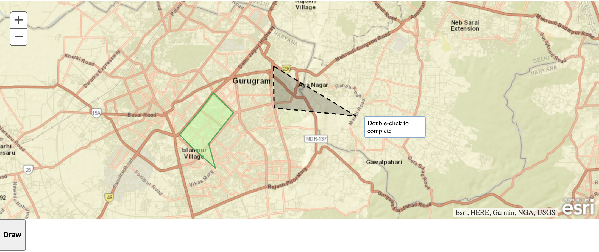

# ArcGIS Geofence Map Demo

This project demonstrates the usage of the ArcGIS plugin to draw geofences on a map using Angular. It provides an interactive interface for users to create, view, and manage geofences directly on the map.

## Features
- Draw geofences (polygons, circles, etc.) on an ArcGIS map
- Interactive map interface
- Built with Angular

## Getting Started

### Prerequisites
- [Node.js](https://nodejs.org/) (v16 or higher recommended)
- [Angular CLI](https://angular.io/cli)

## Sample Output
Below is a sample output showing a geofence drawn on the map:




### Installation
1. Clone the repository:
   ```bash
   git clone <repo-url>
   cd arcgismap
   ```
2. Install dependencies:
   ```bash
   npm install
   ```

### Running the Application
Start the development server:
```bash
ng serve
```
Open your browser and navigate to [http://localhost:4200/](http://localhost:4200/).

## Usage
- Use the map interface to draw geofences by selecting the drawing tool and clicking on the map.
- Save, edit, or remove geofences as needed.

## Project Structure
- `src/app/` - Main application source code
- `public/` - Static assets (including sample output image)

## License
This project is for demonstration purposes.
